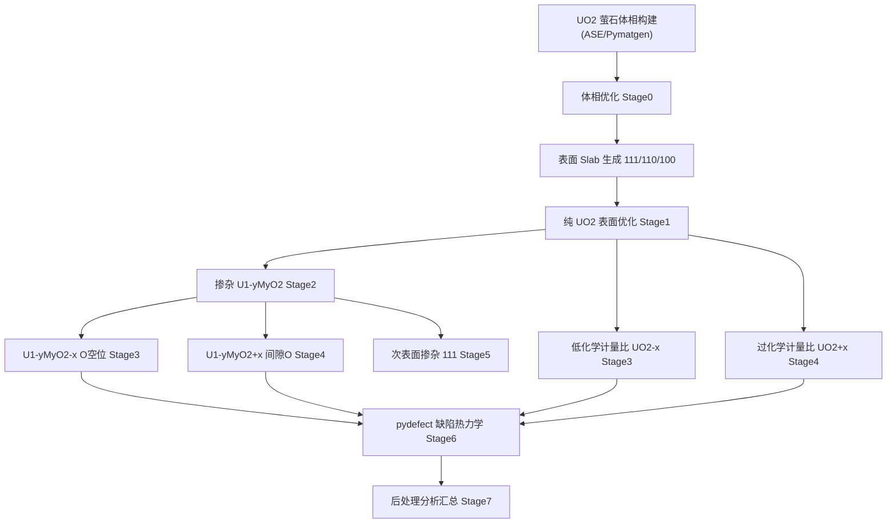

# 02 研究框架与执行工作流

> 本章给出从 UO2 晶体结构出发、覆盖 UO2-x（低化学计量比）与 UO2+x（过化学计量比）、掺杂 Mo/Nb/Zr/Ti 不同元素与含量、以及 O 空位/间隙 O 缺陷作用的**研究框架、执行工作流与分支节点判断标准**。

## 一、研究框架总览

## 二、执行工作流（Workflow）

### Stage 0 — 体相优化（基准能量）

目标：获得 E_bulk、平衡晶格常数，以及参考相 MO2（M = Mo/Nb/Zr/Ti）体相能量与晶格常数；同时计算三重态 O2 分子在 20 Å 盒子中的能量 E_O2。

涉及体系：

| 体系 | 结构 | 说明 |
|------|------|------|
| UO2 | 萤石 Fm-3m，a≈5.47 Å，AFM | 核心宿主 |
| MoO2 | 金红石/扭曲金红石 | 替换能参考相 |
| NbO2 | 金红石 | 替换能参考相 |
| ZrO2 | 立方萤石（与 UO2 同构）| 替换能参考相 |
| TiO2 | 金红石 | 替换能参考相 |
| O2 分子 | 20 Å 盒子 | 空位形成能参考（三重态） |

**收敛判据**：UO2 晶格常数与实验值（5.47 Å）偏差 < 2%；每个体系 EDIFFG 达到力收敛。

### Stage 1 — 纯 UO2 表面

目标：复现文章表面能（111/110/100 = 0.51/0.91/1.34 J/m²）。

构建 6 层 2×2 slab、18 Å 真空层，全弛豫。用 eq.(1) 计算表面能。

**分支判断**：
- E_sur(111) ∈ [0.45, 0.60] J/m² → 通过，进入掺杂；
- 偏差大 → 检查 slab 厚度（增到 8 层）、k 点密度、磁矩初始化（亚稳态）。

### Stage 2 — 化学计量比 U1-yMyO2 表面

目标：4 元素 × 4 含量 × 3 晶面 = 48 个体系（含量仅需做 (111) 的 17/25/33，8 已在 MOX-8 全覆盖）。

- 表面掺杂（方法 A）：每侧替换 1/2/3/4 个表面 U → y = 0.08/0.17/0.25/0.33；
- 对 (110)/(100) 只做 y = 0.08（MOX-8）；
- ISIF = 2 弛豫（保持 UO2 表面晶胞参数）。

**分支判断**：
- 替换能 E_rep 随 (111)→(100) 递减、随元素/含量趋势单调 → 通过；
- E_rep 异常（如出现 > 10 eV 或剧烈跳变）→ 检查是否亚稳态、POTCAR 价态一致性。

### Stage 3 — 低化学计量比（O 空位）

目标：O 空位形成能 E_for，以及两个多余电子的自旋密度分布。

体系（两侧对称操作）：
- UO2-x：纯 UO2 表面两侧各移除 1 个表面 O；
- U1-yMyO2-x（MOX-8 起）：空位**紧邻**掺杂元素 / 空位**远离**掺杂元素两类；
- 对 (111) 的高含量体系补充空位构型（每个掺杂位次选取代表性空位位置）。

**分支判断**：
- 纯 UO2 空位能 ≈ 5.81/5.47/4.98 eV（111/110/100）→ 验证方法正确；
- 自旋密度再分配合理（空位 + 邻近 U 分担两个电子）→ 继续；
- 亚稳态：同一构型用 2-3 组初始磁矩计算，取最低能。

### Stage 4 — 过化学计量比（间隙 O）

目标：U1-yMyO2+x 中间隙氧的形成能，评价掺杂元素对过量氧容纳能力的影响。

- 间隙 O 位置：体心 4b（1/2,1/2,1/2）型八面体间隙（UO2 中常见 interstitial）；
- 在 slab 两侧对称加入间隙 O，O:M = 2.08:1（对应 x = 0.08）；
- 考察间隙 O 与掺杂元素的空间关系（紧邻/远离）。

**分支判断**：
- 间隙 O 形成能 E_f(O_i) = (E_super − E_sto − 0.5 E_O2) 合理（正值，取决于化学势）；
- 与空位形成能对比，判断 UO2±x 的偏好方向（缺 O 或过 O）。

### Stage 5 — 次表面掺杂（仅 111）

目标：方法 B（2nd+5th 层）、方法 C（3rd+4th 层），化学计量比 + 空位两种状态。

- 每侧替换 1 个次表面 U（MOX-8 浓度）；
- 空位取远离掺杂元素的表面位置，便于对比。

**分支判断**：
- 替换能对方法 A/B/C 不敏感 → 与文章结论一致；
- 若某元素在次表面出现异常氧化态 → 记录并分析电荷补偿路径。

### Stage 6 — pydefect 缺陷热力学分析

目标：对代表性缺陷（V_O、O_i、M_U 置换）计算**缺陷形成能（多电荷态）、热力学转变能级、载流子俘获能**，并与表面计算交叉验证。

详见 `05_pydefect/run_pydefect.py` 与 `docs/04`。

**分支判断**：
- 转变能级位于 UO2 带隙（DFT+U 约 1.8-2.2 eV）内 → 该缺陷是深能级/浅能级给出物理解释；
- 缺陷形成能 vs 掺杂元素排序与表面 E_for 排序一致 → 内洽。

### Stage 7 — 后处理与汇总

- 表面能 / 替换能 / 空位形成能 / 间隙氧形成能表格与图；
- 自旋密度 → 氧化态地图；
- Bader 电荷 → 电荷转移量；
- 键长位移 → 结构畸变；
- 写入 `results/*.csv`。

## 三、分支节点判断标准汇总

| 节点 | 判断条件 | 通过动作 | 不通过处理 |
|------|----------|----------|-----------|
| N1 体相收敛 | \|a_calc − 5.47\|/5.47 < 2% | 进入 Stage 1 | 调整 Ueff/ENCUT/初始磁矩 |
| N2 表面能 | 0.45 < E_sur(111) < 0.60 J/m² | 进入 Stage 2 | 增 slab 厚度 / 检查磁性设置 |
| N3 替换能 | 趋势单调、与半径失配/氧化还原电位相关 | 进入 Stage 3 | 检查亚稳态、POTCAR |
| N4 空位能 | UO2 空位能接近 5.81/5.47/4.98 eV | 进入 Stage 4 | 检查 O2 参考能量、亚稳态 |
| N5 过计量比 | 间隙 O 形成能与空位能对比合理 | 进入 Stage 5 | 检查间隙位选择 |
| N6 位次效应 | 方法 A/B/C 替换能差异 < 0.2 eV | 进入 Stage 6 | 记录异常、重查磁性 |
| N7 pydefect | 转变能级位于带隙内、排序内洽 | 进入 Stage 7 | 检查化学势/电荷态设置 |
| N8 汇总 | 所有物理量趋势自洽 | 出报告 | 针对性重算 |

## 四、计算量估算

| Stage | 体系数 | 每体系近似核时（64 核） | 备注 |
|-------|--------|------------------------|------|
| 0 体相 | 6 | 0.5-2 h | 小原胞 |
| 1 表面 | 3 | 4-8 h | 96 原子 slab |
| 2 化学计量比 | 48 | 4-8 h | 掺杂 slab |
| 3 空位 | ≈ 40 | 4-8 h | 含亚稳态重算 |
| 4 过计量比 | ≈ 12 | 4-8 h | 间隙氧 |
| 5 次表面 | ≈ 16 | 4-8 h | 111 面 |
| 6 pydefect | ≈ 30 | 1-4 h | 各电荷态单点 |
| 合计 | ≈ 155 计算 | — | 建议批处理并行 |

> 实际核时取决于机器性能与收敛速度；建议先跑 2-3 个代表体系校准 EDIFFG 与 NCORE 后再批量。
